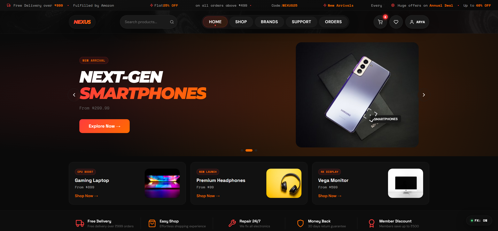
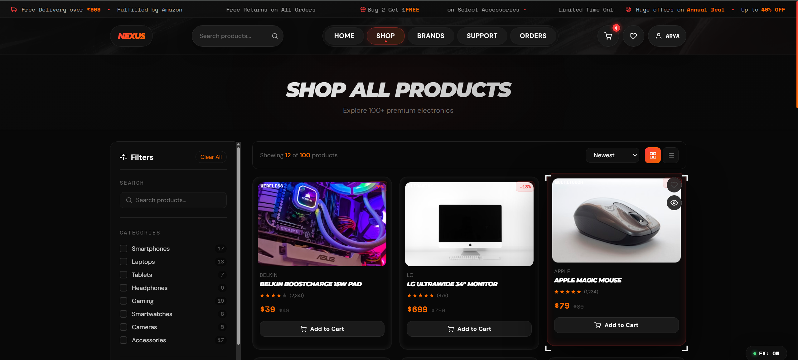
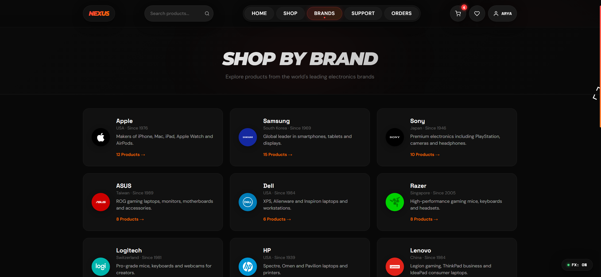
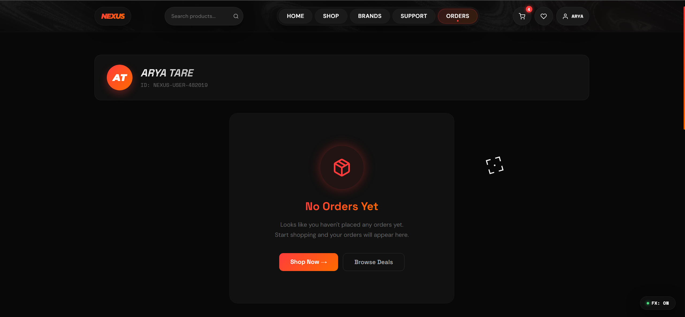
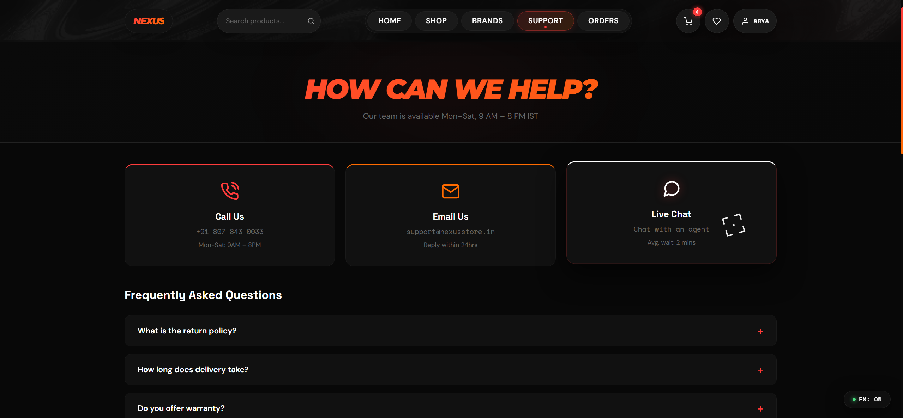
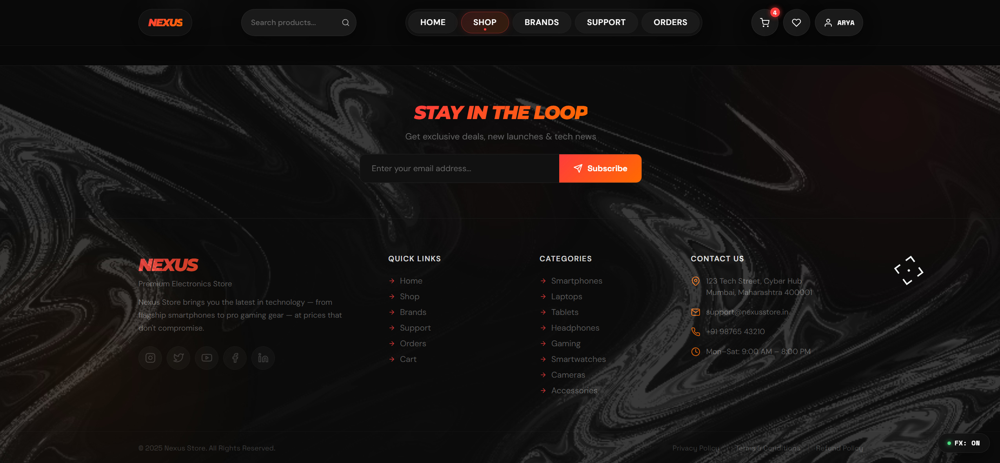

# ⚡ NEXUS STORE — Premium Electronics E-Commerce Store
https://nexus-ecommerce-beta.vercel.app/

Welcome to **NEXUS STORE**, a modern, high-performance, visually rich electronics e-commerce catalog application built with React, Vite, and GSAP. 

The site is designed with a premium dark-mode aesthetic utilizing a black, red, and orange theme, custom display typography, glassmorphic layout elements, and high-performance WebGL animations.

---

## 📸 App Previews

Here are the visual showcases of the **NEXUS STORE** interface:

### 🏠 Homepage & Hero Banner


### 🛒 Catalog & Shop Page


### 🏷️ Brand Showcase & User Orders
| Brand Showcase | User Orders |
| :---: | :---: |
|  |  |

### 📞 Support Desk & Footer Layout
| Support Desk | Glassmorphic Footer |
| :---: | :---: |
|  |  |

---

## 🚀 Key Features

* **Interactive Hero Banner**: Features a custom slide banner utilizing 3D hover tracking and smooth navigation.
* **Animated Pill Navigation Header (`<PillNav />`)**: A floating navigation header using GSAP animation logic for hover bubble fills and active states, featuring a compact search pill, account pill (`ARYA`), and a cart count badge.
* **Framer Motion 3D Hover (`<TiltedCard />`)**: Applies dynamic 3D mouse tilt transformations to product cards, promo banners, and the main gallery page photo.
* **spotlight & Magnetism Bento Grid (`<MagicBento />`)**: An interactive dashboard showcase highlighting store advantages (Secure Checkout, Free Shipping, Official Warranty) with cursor spotlights, particle stars, magnetism, and click ripples.
* **Performance Mode (FX Switch)**: Includes a persistent floating toggle (`FX: ON` / `FX: OFF`) which disables heavy WebGL shaders, composite blurs, and cursor animations on lower-end devices, guaranteeing a 60 FPS page.
* **Comprehensive Cart Flow**: Built-in cart state context allowing items to be added, quantities managed, discount codes applied (`NEXUS25`), and orders simulated.

---

## 🎨 Visual Identity

- **Theme Palette**: Dark gray / black backgrounds (`#0a0a0a`, `#080808`, `#111111`) accented by red (`#ff3c3c`) and orange (`#ff6b00`) gradients.
- **Typography**: Display headings (logos, headers, banners, product names) use **Montserrat Black Italic** (`font-weight: 900`, `font-style: italic`, uppercase, tight tracking) to communicate a bold, high-performance gaming style.
- **Visual Filters**: Utilizes SVG displacement map filter variables to achieve glassmorphism.

---

## 🖼️ How to Add and Use Images in the Project

You can add images to the project using either **Local Assets** or **Remote URLs**. Below is the guide on how to implement them.

### Option A: Using Local Images (Recommended for UI Icons / Logos)

1. **Place the Image File**:
   Copy your image file (e.g., `logo.png`, `banner.jpg`) into the `src/assets/` directory.

2. **Import the Image in React**:
   Import the image file at the top of your JSX component. Vite will compile and optimize it automatically.
   
   ```jsx
   import React from 'react';
   import customLogo from '../assets/logo.png'; // Path to your asset
   
   const MyComponent = () => {
     return (
       <div className="logo-container">
         
       </div>
     );
   };
   
   export default MyComponent;
   ```

### Option B: Using the Public Directory (Static Files)

1. **Place the Image File**:
   Copy your image file into the `public/` directory (e.g., `public/images/headset.png`).

2. **Reference the Absolute Path**:
   You do not need to import files placed in the `public` folder; reference them using an absolute path beginning with `/`.
   
   ```jsx
   const MyComponent = () => {
     return (
       
     );
   };
   ```

### Option C: Using Remote Images (e.g., Unsplash for Products)

For product catalogs, the database uses high-quality Unsplash image URLs. To prevent slow page load times and heavy bandwidth, always append width constraints (`&w=400` or `&w=800`) to the image URL query.

1. **Open [data/products.js](file:///c:/Users/Arya%20Tare/Desktop/Ecommerce/src/data/products.js)**.
2. **Add the Image URL**:
   Ensure you use clean links containing width tags (`w=400` for grid thumbnails, `w=800` for high-resolution gallery details).
   
   ```javascript
   export const products = [
     {
       id: 101,
       name: "Nexus Steel Mechanical Keyboard",
       brand: "Nexus",
       category: "Accessories",
       price: 129,
       // Optimized Unsplash link with width parameters:
       image: "https://images.unsplash.com/photo-1618384887929-16ec33faf9c1?w=400&q=80",
       specs: { ... },
       features: [ ... ]
     }
   ];
   ```

### Option D: Adding Screenshots/GIFs to the README.md File (for GitHub display)

If you want to display preview screenshots or GIFs of your working site directly inside this `README.md` file so that visitors can see them on GitHub:

1. **Create a Folder**: Create a folder named `screenshots/` at the root of your project directory.
2. **Add Your Images**: Place your screenshot or GIF files (e.g., `homepage.png`, `mobile_demo.gif`) into that folder.
3. **Link Them in README.md**: Reference them inside this file using a relative path like this:
   ```markdown
   
   ```
4. **Commit & Push**: Add, commit, and push the `screenshots/` folder along with your code changes. GitHub will render the images on your repository page automatically!

---

## 🛠️ Installation & Development

### 1. Install Dependencies
Make sure you have [Node.js](https://nodejs.org/) installed. Run:
```bash
npm install
```

### 2. Run the Development Server
Starts the Vite dev server with Hot Module Replacement (HMR) active:
```bash
npm run dev
```
Open [http://localhost:5173/](http://localhost:5173/) in your browser.

### 3. Build for Production
Compiles and bundles the application into minified files under the `dist/` directory, optimized for deployment:
```bash
npm run build
```

---

## ⚡ Performance Best Practices

To maintain high visual quality without sacrificing speed, keep these guidelines in mind:
- **Keep CSS Blurs Off**: Do not use heavy Gaussian blurs (`filter: blur()`) on large viewport elements. Instead, use soft radial gradients.
- **Dynamic Mobile Rendering**: If adding heavy graphics or animations, check `window.innerWidth` and conditionally return `null` on mobile screens to save mobile CPU/GPU memory.
- **Scale Canvas Layers**: Draw interactive WebGL canvases at `0.5x` scale (`scale = 0.5` inside the resize event) and stretch them with `width: 100%; height: 100%` in CSS. The browser will handle the stretching with hardware-acceleration, resulting in a smooth blur without lagging the frame rate.
